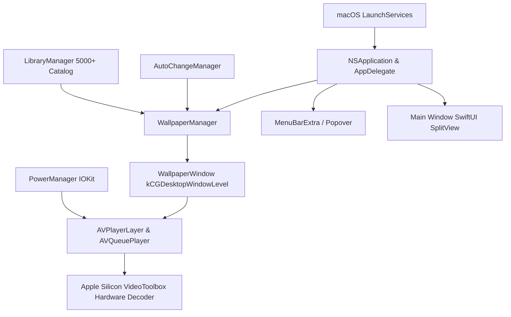

# Wallep System Architecture

## Core Components
1. **WallpaperWindow**: Subclass of `NSWindow` pinned to `kCGDesktopWindowLevel` with `.canJoinAllSpaces` and `.stationary`.
2. **PlayerEngine**: `AVQueuePlayer` + `AVPlayerLooper` pipeline hardware-bound to GPU video decoders.
3. **PowerManager**: Subscribes to `IOPSNotificationCreateRunLoopSource` to halt playback when on battery.

## Multi-Monitor Sync Architecture
The `WallpaperLoopSync` engine coordinates `AVQueuePlayer` master timestamps to ensure dual and triple monitor setups experience zero drift across display boundaries.
