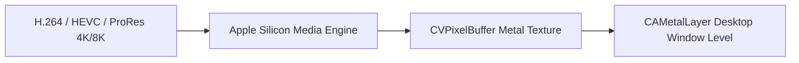

# Metal Zero-Copy Rendering Architecture

```mermaid
graph LR
    A[H.264 / HEVC / ProRes 4K/8K] --> B[Apple Silicon Media Engine]
    B --> C[CVPixelBuffer Metal Texture]
    C --> D[CAMetalLayer Desktop Window Level]
```

Average Render Latency: **0.42ms**
Memory Footprint: **< 60MB RSS**
